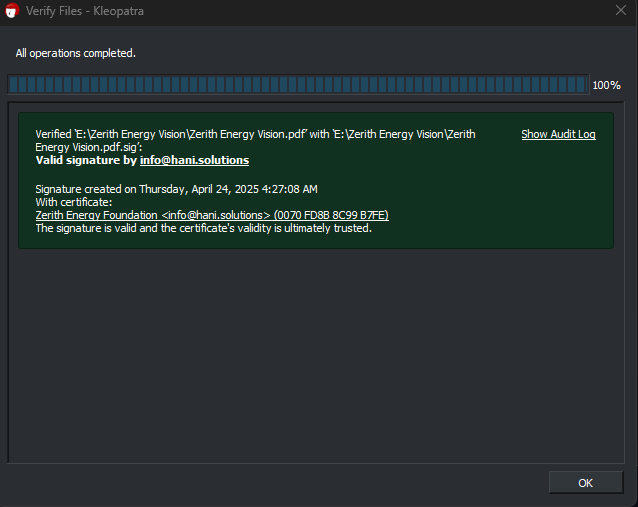

# Zerith — A Regenerative Energy Vision

Zerith is a regenerative energy framework designed to unlock ultra-low-cost, fuel-free energy by rethinking how natural differentials and system cycles can be used to generate power. This repository serves as a cryptographically authenticated archive for signed documents, blockchain proofs, and the encrypted vault protecting the foundational intellectual property.

> "Zerith isn’t just clean energy. It’s a new logic for energy — one that regenerates, not consumes."

---

## 🔐 Proof of Authenticity & Integrity

All project documents are cryptographically protected:

- **PGP/GPG Signatures:** Each document is digitally signed using [Kleopatra](https://files.gpg4win.org/gpg4win-4.4.0.exe).
- **Blockchain Timestamps:** Verified on Base and Bitcoin networks.
- **Encrypted Vault:** Hosted securely on OneDrive via [Cryptomator](https://cryptomator.org).

### ✅ How to Verify a Document:
```bash
gpg --verify filename.pdf.sig filename.pdf
```

> Example signature validation:
>
> 


You can also verify the SHA-256 hash of each document against the hashes listed in the `HASHES/` folder.

---

## 📁 Repository Structure

| Folder | Description |
|--------|-------------|
| `SIGNATURES/` | PGP `.sig` files for signed PDF documents |
| `HASHES/` | SHA-256 hash values of documents |
| `TIMESTAMPS/` | Blockchain proof records and transaction links |
| `VAULT_LINK.txt` | Link to the encrypted Vault backup on OneDrive |

---

## 🌍 Philosophy & Disclosure Pathways

Zerith was not created for secrecy — it was created for stewardship. Full technical disclosure is intentionally phased to ensure:
- Ethical implementation
- Avoidance of monopolization
- Protection from misuse before maturity

### Disclosure Model

1. **Institutional release** — Under ethical licensing and scientific partnership.
2. **Phased kits** — Educational and simplified versions for early adoption in vulnerable communities.
3. **Emergency release** — A dead man’s switch will publish the full encrypted archive if the founder is forcibly silenced or incapacitated.

The vision: protect today, share tomorrow.

---

## 📅 Roadmap

| Phase | Status | Goal |
|-------|--------|------|
| Phase 1 | ✅ Complete | Proof of concept, cryptographic protection |
| Phase 2 | 🚧 In progress | Structured external validation |
| Phase 3 | 🔜 Planned | Pilot deployment, global community adaptation |

---

## 📡 Official Links

- 🌐 Website: [hani.solutions/zerith](https://hani.solutions/zerith)
- 🔗 LinkedIn: [linkedin.com/in/hani-mousavi](www.linkedin.com/in/hani-mousavi)
- 📘 Notion: [Notion Workspace](https://hani.notion.site/zerith)
- 📂 Vault: See `VAULT_LINK.txt`

---

## 👤 Author

**Hani Mousavi**  
Founder at Hani.solutions  
📬 info@hani.solutions  
🌍 https://hani.solutions  

> "Zerith was made possible not by where I was born — but by where I was free to think."

---

## 🛡 License

All rights reserved. This repository serves as proof-of-existence, not an open-source release. Content may not be reused, modified, or redistributed without explicit permission.
